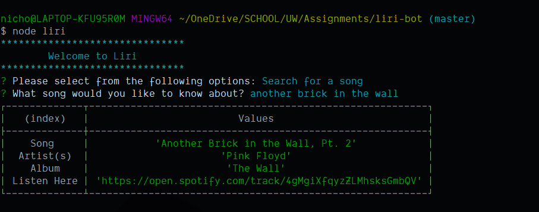

# LIRI Bot

Language Interpretation and Recognition Interface

---

## Using LIRI

To begin using LIRI, call her using node

```bash
node liri
```

### Opening Menu

At the welcome menu, use the up and down arrow keys to select one of LIRI's options


### Find Concerts

LIRI can utilize the Bands In Town API to find concerts of any band you want. Just type their name into the prompt and LIRI will tell you how many concerts she found, as well as the Show Time, Venue, Location and the Lineup of the entire show.


### Song Information

LIRI uses the Spotify API to find Information about your favorite songs. Just type in the name of the song (as well as the artist if you want to be more specific), and LIRI will display a card with the name of the song, the recording artist(s), the album the song was released on, and a link to the song in Spotify's web player.


### Movie Search

LIRI provides meta information about any movie in OMDB's database using only its title.


### Automatic Suggestion

LIRI can also take the decision making out of using the product by selecting a function for the user at random. She will then select a predetermined option for whichever mode she chooses.

